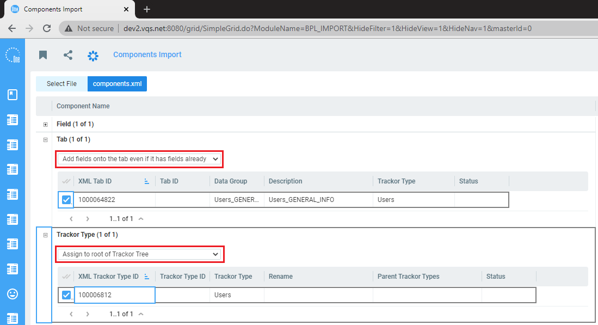

# Installation 

1. Import components
    + Select components.xml file on Components Import page
    + If there is no OneVizion User Trackor Type in the configuration, then select all components to import
	    * In the Tab section in selector, select 'Add fields onto the tab even if it has fields already'
        * In the Trackor Type section in selector, select 'Also import Trackor Tree relations' or 'Import Trackor Tree relations only'
        
	+ If the configuration already has OneVizion User Trackor Type, then select only Field to import
	    * Add a field to the tab of OneVizion User Trackor Type
	
2. After importing, you need to fill in the Slack Channel field for users
3. You can start setting up the integration