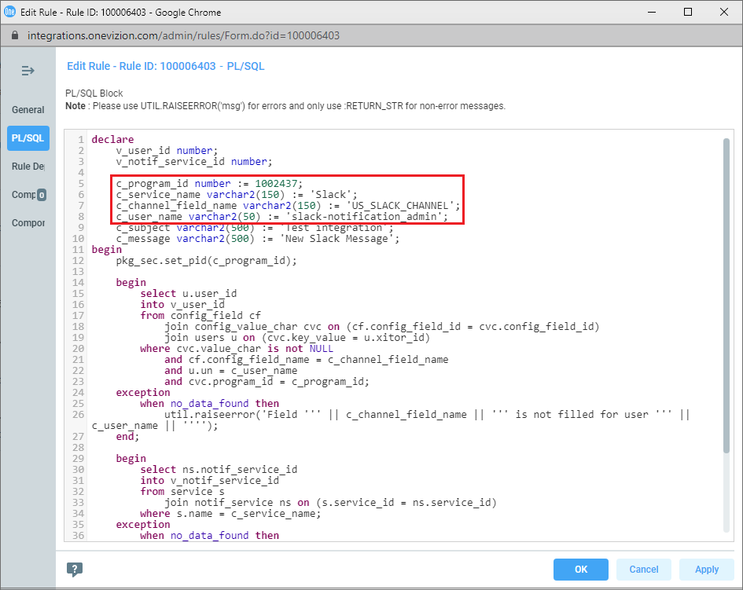

This is the Rule that creates a Notification for the User who has the Slack Channel field filled.
The configured integration will view this Notification and send a message to Slack, to the channel specified in the Slack Channel field.

# Requirements
* The components required for the integration to work are installed. [More details.](https://github.com/ov-integrations/slack-notification/tree/IHub-171030/setup#installation)
* Integration configured. [More details.](https://github.com/ov-integrations/slack-notification#slack-notification)

# Installation 

1. Import components. Select all components to import.
2. After import, you need to open the 'TEST_INTEGRATION_SLACK_1' rule.
3. On the PL/SQL Tab, replace the values ​​of the variables:
	* c_program_id
	* c_service_name - Notification Service name, created during integration setup
	* c_channel_field_name - channelField in the settings.json
    * c_user_name - username for which the v_channel_field_name field is filled
	
4. Enable Rule.
